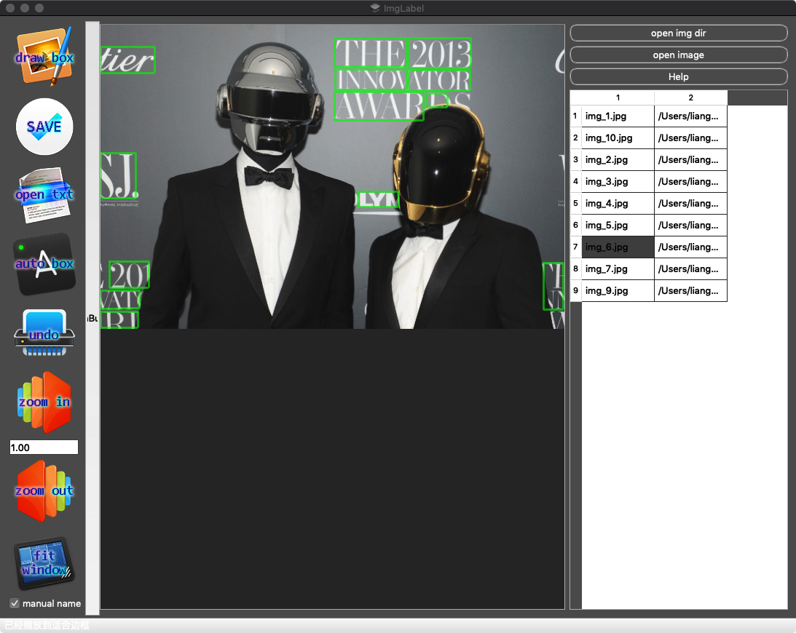
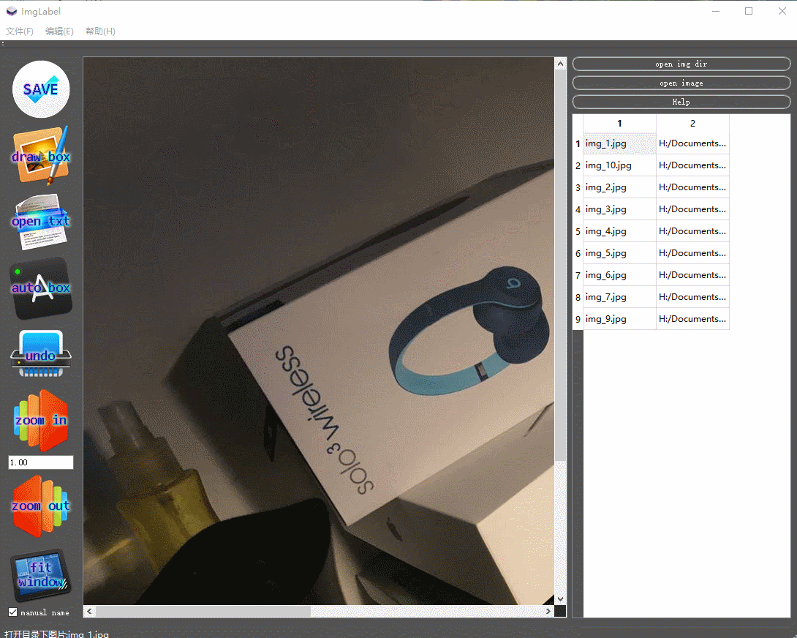
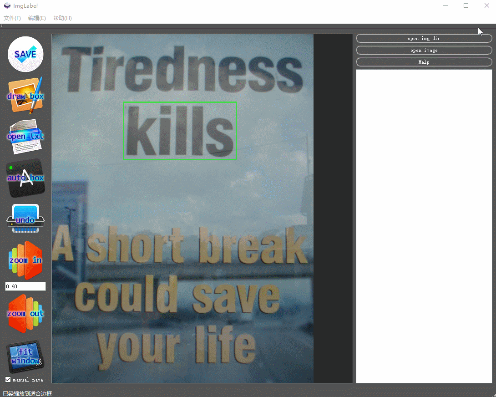
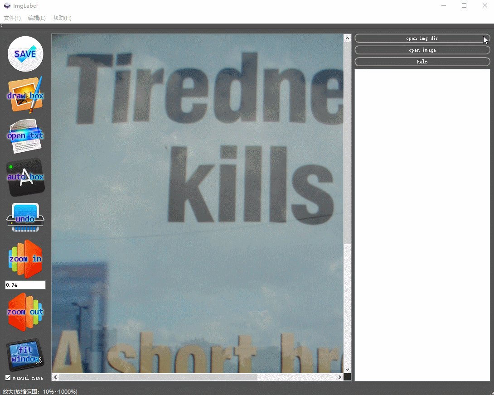

# LabelImg

LabelImg is a graphical image annotation tool.

Coded for a software engineering curriculum design.

# Installation
## Windows 10

Win10 User can open released version directly by clicking LabelImg.exe.

Current release build (v0.9) on window haven't implemented Pixel-Vision auto label function yet due to python version and tensorflow version issue.

## MAC OSX

MAC OSX version implemented Pixel-Vision auto label function. But my macdeployqt is broken so you have to build it from source using qt.

## Prerequisites
(Only tested on) macOS Mojave 10.14.2 and Windows 10 with:
* Python 2.7
* Tensorflow-gpu >= 1.1
* opencv2
* setproctitle
* matplotlib
* qt(for mac)

# Usage
## macOS
There are two ways of using this program: editing single file and editing multiple files

open file

* Press open file button and select a image.(ctrl + o)

open multiple files

* Press open file dir button and select a path, then double click a file name in the right side. (ctrl + d)

load existing labels from txt

* Press open txt button and selsect a txt, the program will load the rect boxes and show it.
* In multiple files, select the path where txt is saved. And clicking it again will load the txt.

modify labels

* Use left button to drag edge or corner. Use right click to delete. Use right button to drag the box as a whole.

auto label

* Click auto label(this may take a while)

Status bar will always show what you are doing and give instructions to assist you.

You can also click help button for more(I'll translate it later).

Annotations are saved as txt files in ICDAR2015 format. You can also load ICDAR2013 format with openTxt.

## Windows 10
Usage is the same with macOs version except for auto label, which is not yet implemented. But it still works well as a functioning labeler.

# Test on ICDAR2013
The reported results on ICDAR2013  are:

|Model|totalM|totalN|totalK|Recall|Precision|H-mean|
|---|---|---|---|---|---|---|
|PixelLink|1095|1090|704|64.30%|64.587%|64.44%|

This is lower than theoretical F-mean 83.7% from [ZJULearning/pixel_link](https://github.com/ZJULearning/pixel_link), but is enough in this scenario.

I also expect it to be higher in ICDAR2015 dataset because it can detect oblique rectangle.

# Screen shots

button icons are changed in my final version because I think these may be subject to copyright.

# Acknowlegement
1.https://tensorflow.google.cn/ 

2.https://www.python.org/ 

3.https://www.scipy.org/docs.html 

4.https://www.qt.io/ 

5.https://pytorch.org/ 

6.Ren S, He K, Girshick R, et al. Faster R-CNN: towards real-time object detection with region proposal networks[C]// International Conference on Neural Information Processing Systems. 2015.

7.Redmon J , Divvala S , Girshick R , et al. You Only Look Once: Unified, Real-Time Object Detection[C]// 2016 IEEE Conference on Computer Vision and Pattern Recognition (CVPR). IEEE Computer Society, 2016.

8.Deng D, Liu H, Li X, et al. PixelLink: Detecting Scene Text via Instance Segmentation[J]. arXiv preprint arXiv:1801.01315, 2018. https://github.com/ZJULearning/pixel_link